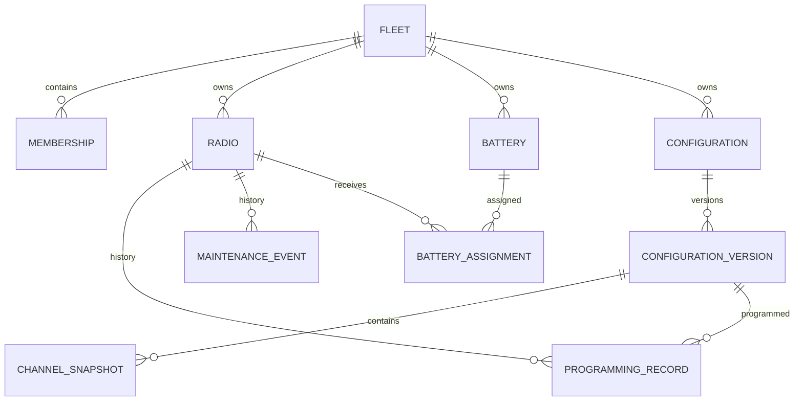

# Codeplug Vault — project brief and agent handoff

**Status:** Planning specification, 22 September 2026  
**Intended audience:** A coding agent or developer building an initial Django application  
**Product goal:** A hosted, private-by-default radio fleet and codeplug management app that a small group of racing spotters can use, with a path to other radio users and teams.

## Instructions for the implementing agent

Read this brief before creating models or pages. Work in small, runnable milestones. If a repository already exists, inspect it and its instructions first; preserve its conventions and explain any proposed deviation. Do not claim the entire product is done after implementing one milestone. At the end of each milestone, report files changed, migrations, commands run, test results, and outstanding decisions. Keep secrets and real user codeplug files out of git. Do not deploy, purchase services or a domain, invite users, or publish data without the owner's explicit instruction. Ask only when a decision blocks implementation; use the defaults below otherwise.

This brief is a target and a suggested sequence, not a demand to build every feature at once. Start with Milestone 0 and Milestone 1. Maintain an application that can run and be demonstrated after every milestone.

## 1. What the product does

Codeplug Vault records physical radios and batteries, configuration families and versions, which version was programmed into each radio, and maintenance history. A team member can find a radio, see its present state, retrieve a permitted codeplug file, and understand how its configuration changed. Motorola CPS or another vendor's programming software still programs the device; Codeplug Vault does not write to radios or promise to decode proprietary codeplug formats.

**Primary initial users:** Alex and a few racing spotter friends managing small fleets, often from a phone at the track. They need quick identification, status, configuration and battery information. The architecture should allow other teams to create isolated fleets.

**Core vocabulary**

- **Fleet:** A private workspace that owns radios, batteries, configurations and membership. A person's initial personal fleet is just a fleet with one member.
- **Radio:** One physical device, identified by an internal asset label; serial number is optional when unknown.
- **Battery:** One tracked physical pack. Some teams may leave batteries untracked or unassigned.
- **Configuration:** A named family such as “Race Weekend.”
- **Configuration version:** A frozen snapshot in that family, optionally with a privately stored vendor file and structured channel notes.
- **Programming record:** The event that a specific version was programmed into a specific radio. The latest confirmed record can be shown as its current configuration; an intended assignment is not proof of programming.
- **Maintenance event:** A dated note about repair, inspection, firmware, antenna, or another action.

### Main user journeys

1. A user signs in, creates or enters their fleet, and adds an XPR7550e with an asset label, purpose, and status.
2. They add batteries if they track them and assign one to a radio; the app shows the present assignment and past swaps.
3. They create a configuration family, add version 1 and its notes, and optionally attach a vendor file. They record that version 1 was programmed into a radio.
4. Later they create version 2, see an explicit comparison of structured data they entered, and record programming events for the updated radios.
5. An authorized teammate searches for an asset on a phone and sees its current battery, last confirmed configuration, maintenance, and permitted file download.

## 2. Scope and boundaries

### Initial usable release (Milestones 0–2)

- Django project, local setup, database migrations, development seed instructions, basic documentation and tests.
- Sign in and sign out using Django authentication; an owner can create a private fleet.
- Fleet membership and roles: owner, editor, viewer. The first release can use owner-created accounts or a controlled invite flow rather than open public signup.
- Fleet-scoped radio list, detail, create, edit and archive; asset label, manufacturer, model, band, radio ID, firmware, purpose, status and notes.
- Optional battery inventory and current assignment with assignment history.
- Maintenance timeline on the radio page.
- Search/filter radio inventory by asset label, manufacturer, model, status and purpose.

### First codeplug release (Milestone 3)

- Named configuration families and immutable versions.
- Optional private attachment on a version, with original filename, byte size and SHA-256 checksum.
- Version-specific structured channel records for comparison; these are manually entered metadata, never a claim that a vendor file was parsed.
- Explicit programming records linking a radio to a version, timestamp, actor and optional note.
- Authorized download of attached files.

### First hosted alpha (Milestone 4)

- Managed PostgreSQL, private object storage for attachments, HTTPS, production settings, migrations, backups, and a tested restore procedure.
- A small invited group from distinct fleets. Verify tenant isolation with separate accounts before inviting them.

### Later improvements, in feedback order

- Compare two structured configuration versions (added/removed/changed channels); QR asset labels linking to authenticated detail pages; CSV import/export; faster phone workflows; optional public templates; API; reminders; dashboards. Public templates require a deliberate publish action and separate review of what data can be exposed. No public sharing in the alpha.

**Explicitly outside the first release:** CPS replacement, automatic decoding of proprietary files, programming hardware, radio frequency recommendations, public codeplug repository, billing, mobile native app, microservices, Redis/Celery, elaborate analytics and real-time sync.

## 3. Product decisions and defaults

| Question | Default for implementation |
| --- | --- |
| Tenant boundary | Every domain record belongs to exactly one Fleet. Access comes from active Membership. |
| Personal inventory | Create a personal fleet on onboarding; no separate ownership code path. |
| Roles | Owner manages membership and all records; editor changes inventory/configuration; viewer reads permitted fleet records and downloads. |
| Radio deletion | Archive radios by default; preserve programming and maintenance history. Permanent deletion is an owner-only, deliberate administrative operation later. |
| Battery tracking | Optional; permit a radio without a tracked battery. One battery has at most one current radio assignment. |
| Config state | A programming record records an observed action. Do not infer success from merely selecting a target version. |
| Versioning | Published version content is immutable. Draft versions may be edited until published; create a new version to make subsequent changes. |
| Files | Private by default. Random storage keys; retain the user-facing original filename separately. No public object URLs. |
| Identifiers | Internal primary keys are implementation details; use UUIDs for externally addressed radios/configurations or similarly unguessable public IDs. Authorization remains mandatory. |
| UI | Server-rendered Django templates, accessible responsive CSS. Add HTMX only where it meaningfully simplifies a workflow. |
| Database | PostgreSQL for production; local development may use PostgreSQL in Compose. |
| Hosting | Render is a reasonable first candidate, subject to a fresh cost/features review at deployment time. Infrastructure should stay portable. |

## 4. Suggested data model

Use Django's standard User model unless there is a concrete reason to customize it before the first migration. Use explicit `related_name`s, sensible database constraints, and indexes for fleet and search fields. Exact class names may change if the repository already has established conventions.

| Entity | Key fields and relationships | Rules |
| --- | --- | --- |
| Fleet | `id`, `name`, `created_by`, timestamps | Private workspace; do not make a global default fleet. |
| Membership | `fleet`, `user`, `role`, `is_active`, timestamps | Unique `(fleet, user)`; prevent loss of the last active owner. |
| Radio | `fleet`, public ID, asset label, manufacturer, model, serial, radio ID, band, firmware, purpose, status, notes, `archived_at` | Unique asset label within a fleet; serial may be blank; never expose another fleet's record. |
| Battery | `fleet`, asset label, maker, model, serial, chemistry, capacity, condition, notes, `archived_at` | Unique asset label within a fleet; no required radio. |
| BatteryAssignment | `fleet`, `battery`, `radio`, `started_at`, `ended_at`, `assigned_by`, note | At most one active assignment per battery; decide whether a radio may have multiple active batteries (default: one). Enforce cross-fleet consistency. |
| MaintenanceEvent | `fleet`, `radio`, `kind`, `occurred_at`, `recorded_by`, notes | Append-oriented; preserve actor and timestamps, allow corrections with an audit trail. |
| Configuration | `fleet`, name, description, compatibility notes, `archived_at` | A family; not a mutable version. |
| ConfigurationVersion | `fleet`, `configuration`, version label/number, state, release notes, creator, timestamps | Unique version within family; published content frozen. |
| ChannelSnapshot | `fleet`, `version`, stable position/key, zone, name, mode, RX/TX frequencies as decimal values where entered, relevant optional analog/DMR fields, notes | Validate fields for selected mode; channels are user-entered descriptions, not parsed truth. |
| VersionAttachment | `fleet`, `version`, private storage key, original filename, byte size, SHA-256, uploaded_by, uploaded_at | Optional; handle upload failure without leaving a published version pointing to a missing file. |
| ProgrammingRecord | `fleet`, `radio`, `version`, `programmed_at`, `recorded_by`, note | Both linked objects must belong to the same fleet. Latest confirmed record determines the displayed current config. |

Avoid a direct many-to-many `Radio ↔ ConfigurationVersion` as the sole source of state: it cannot express *when* a radio was programmed or distinguish history from current state. A cached current version field is optional only after correctness is established and must be kept consistent with programming records. Avoid a mutable `battery_id` on Radio as the sole assignment history.

**Tenant integrity matters beyond filtering views.** In forms/services, reject any related object from a different fleet. Where practical, centralize scoped selectors and mutation services; consider database constraints where they can actually enforce an invariant. Standard foreign keys alone do not ensure two linked rows share a fleet.

### Example relation sketch



## 5. Architecture and repository shape

Start with a Django monolith. Suggested layout:

```text
codeplug-vault/
  README.md
  pyproject.toml
  .env.example
  compose.yaml                  # optional local PostgreSQL
  manage.py
  config/                       # settings, URLs, WSGI/ASGI
  apps/
    fleets/                     # Fleet, Membership, permissions
    radios/                     # Radio, battery, maintenance, assignments
    configurations/             # families, versions, channels, attachments
  templates/
  static/
  tests/                        # or tests within each app
```

Use a supported Django release and pinned dependencies selected at implementation time. Choose the smallest dependency set that supports the work; Django forms/admin/auth and standard Python utilities can carry much of the MVP. PostgreSQL and a private object-store compatible Django storage backend are deployment concerns. Add a REST API only when a real client needs one. Configuration comparison logic should live in a small pure function or service with focused tests rather than in templates.

### Example route structure

- `/fleets/` and `/fleets/<id>/`: select fleet and see summary.
- `/fleets/<id>/radios/`, `/radios/new/`, `/radios/<public-id>/`, `/radios/<public-id>/edit/`.
- `/fleets/<id>/batteries/` and assignment action on a radio.
- `/fleets/<id>/configurations/`, family detail, version detail and publish.
- `/fleets/<id>/radios/<public-id>/programming/` to record a programming event.
- `/fleets/<id>/versions/<id>/download/` for authorized attachment download.

Routes are illustrative, not fixed. Resolve fleet context from the URL or an explicit selection, never by trusting an arbitrary submitted `fleet_id`. Scope both list and detail lookups. Check role on every mutation and file download; hiding buttons is insufficient.

## 6. Security, privacy and operations

- Use Django authentication, CSRF protection, secure session settings and server-side role checks. Default new records to private. Do not store passwords or vendor application secrets in configuration records.
- Treat serial numbers, radio IDs, configurations and files as private user data. Never place real customer data, frequencies, radio IDs, codeplugs, credentials or production database dumps in examples, logs or seed fixtures.
- For uploads, cap size at the application and web boundary; allow only an explicitly documented set of extensions/types after confirming actual user needs. Do not trust filename, MIME type or extension as proof of safe contents. Generate random storage keys, store checksum by streaming, download as an attachment, and do not serve untrusted files as executable content or from a public media URL. Assess malware scanning as usage grows.
- Check the fleet and membership before obtaining an object-store download or streaming a file. Short-lived signed URLs are acceptable only after authorization and only if the object stays private.
- Validate all cross-fleet relationships, including battery assignments, programming records, attachments and channel/version associations. Add tests that attempt each cross-fleet action by POST and by guessing a detail/download URL.
- Production configuration: `DEBUG=False`, explicit hosts, HTTPS, secure cookies and proxy settings as applicable, secrets in environment variables, managed database, restricted object storage credentials, static file handling, error logging without sensitive file content, and `manage.py check --deploy` review.
- Back up database **and** attachment objects. Test restoring both into an isolated environment before claiming backups work. Plan how a user can export or delete their fleet data before public beta.
- Changes to published versions and programming history need clear correction semantics; no silent rewriting of past records.

A QR code should contain an opaque URL and still require authorization. UUIDs and opaque URLs reduce enumeration but do not grant access control.

## 7. Milestones and definition of done

### Milestone 0 — repository and foundation

- Inspect any existing repository and project instructions; set up Django, development database, `.env.example`, README run steps, formatter/linter and basic CI if a repo already exists.
- Define model and role rules in a short ADR or README section. Create initial migrations for Fleet/Membership and onboarding.
- **Done when:** a new developer can run the app locally, migrate, create/sign in as a user, create a fleet, and run passing checks/tests. No credentials committed.

### Milestone 1 — radio inventory

- Add fleet-scoped radio model, forms, list/detail/create/edit/archive pages, filters and a useful phone layout.
- Enforce owner/editor write access and viewer read access. Include tenant isolation tests for lists, detail pages and POST actions.
- **Done when:** two users in separate fleets cannot view or change each other's radios, duplicate asset labels are rejected per fleet, and archived radios remain in history but leave the default active list.

### Milestone 2 — batteries and maintenance

- Add optional batteries, assignment/swap workflow and radio maintenance timeline. Show battery and activity on radio detail.
- **Done when:** assignment history survives swaps, one battery cannot be active on two radios, cross-fleet linking fails, and viewers cannot mutate records.

### Milestone 3 — configuration vault

- Add configuration families, draft/published versions, channel snapshots, optional private file uploads and programming records.
- Add version comparison for manually entered channels after the underlying fields and stable comparison key are settled. Display file hash and explain that matching hashes mean matching bytes, not equivalent programming.
- **Done when:** users can create v1 and v2, publish them, compare entered channel changes, attach and privately download a file, record a version programmed into a radio, and see its history. Published version content cannot be edited in place. Tests cover cross-fleet files/relations and upload failures.

### Milestone 4 — hosted, invited alpha

- Create separate production settings, managed PostgreSQL, private object storage, hosting configuration, migration/release procedure and a backup/restore runbook. Provision only when explicitly requested by the owner.
- Test login, authorization, upload, download, migrations and restore in a nonproduction environment first. Invite a few spotters, collect workflow feedback and prioritize it.
- **Done when:** a deployed app passes a production checklist; a restored copy includes database rows and their attachments; distinct fleets remain isolated; the owner approves invitations.

### Milestone 5 — feedback and public beta readiness

- Fix real alpha workflow issues. Add basic account recovery, abuse/rate-limit controls as needed, privacy/data retention policy, export/delete path and operational monitoring before broad self-service signup. Decide whether public templates are useful and safe.
- **Done when:** public launch has a documented support/incident path and the owner explicitly approves it.

Do not use release numbers as a substitute for the above acceptance criteria. Tag versions when a milestone is actually finished.

## 8. Tests that earn their keep

- Model/service constraints: duplicate asset labels per fleet, last owner protection, active battery uniqueness, configuration version immutability and cross-fleet relationships.
- Authorization integration: anonymous, viewer, editor, owner and member of another fleet against detail, edit, archive, programming and file download endpoints.
- Version diff: add/remove/rename/change of a channel; define whether reorder alone counts as a change and test it. Avoid interpreting binary vendor file differences as channel differences.
- File path: successful upload/hash/download, oversize or disallowed upload, unauthorized download, and cleanup behavior if database or storage operations fail.
- Deployment: CI runs format/lint, Django checks, migration checks and tests. Restore rehearsal is an operational test before inviting users, not just a written procedure.

Use generated dummy radios and frequencies in tests. Keep tests concentrated on failure modes and product rules rather than duplicating every template's rendering.

## 9. Questions to resolve with early users

These can wait until the feature they affect is reached:

1. Do spotters manage personal radios, team-owned radios, or both? Can one person belong to several teams?
2. Does a radio normally carry one active battery, or should a team track spare batteries as “issued together”?
3. Do users need to record the codeplug *planned* for a radio separately from the codeplug last confirmed programmed?
4. Which actual file extensions and maximum sizes do users upload from their vendor tools?
5. Which channel fields are worth entering manually? Would a simple notes/checklist workflow be more valuable than a detailed channel editor?
6. Should viewers be permitted to download vendor files, or only view metadata? Default above permits downloads within the fleet; make this a fleet policy if users need stricter control.
7. Should radio serial numbers be unique within a fleet? Unknown, duplicate or refurbished identifiers may warrant a warning instead of a hard constraint.

## 10. First task to give a coding agent

> Read `Codeplug_Vault_Project_Brief.md` and inspect the existing repository and any `AGENTS.md`. Implement Milestone 0 and Milestone 1 only. Start with a short implementation plan and explicit assumptions. Keep the app runnable. Create migrations and meaningful tenant authorization tests. Run the relevant checks, report results and remaining issues, and stop before provisioning hosting, uploading real codeplug files, inviting users or deploying anything.

If starting in an empty repository, the agent may initialize it and choose a supported Python/Django combination. If an existing repository has a stack, adapt the brief to the code rather than replacing working infrastructure without a reason.

## References for the deployment phase

- [Django deployment checklist](https://docs.djangoproject.com/en/stable/howto/deployment/checklist/)
- [Django security guidance, including user-uploaded content](https://docs.djangoproject.com/en/stable/topics/security/)
- [Render's Django deployment guide](https://render.com/docs/deploy-django)
- [Render deploy behavior](https://render.com/docs/deploys)

Review these at implementation/deployment time because platform behavior, prices and supported versions may change.
